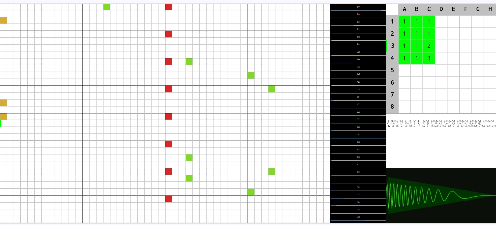

<h1><a href="//bacionejs.github.io/battito/index.html" style="text-decoration: none; color: inherit;">Run</a></h1>

<a href="//bacionejs.github.io/battito/index.html" target="_blank">
    
</a>


Battito is a simple Sonant-based music tracker.

## Purpose
- Why another tracker, when there are several already out there (note1 zzfxm, sonant, soundbox, pl_synth, other that they reference)
- The trackers I found were either too simple or too complex. This app tries to find a middle ground.

## Guide

- There are eight default instruments, or you can import any Sonant JSON.
- To enter a note on the piano, first click ONLY one row and ONLY one column in the **sequencer** and click on the intersecting cell to select a pattern ID. Then you can edit that pattern on the **piano**. You can reuse a pattern ID.
- The song constantly loops over the **selected** sequencer rows and columns. To toggle the whole song, click the upper left of the sequencer.
- You can select multiple sequencer rows and columns for **playback**, but you can only have one row and one column selected while **editing** notes on the piano.
- Supports 4 octaves from C3 through C6, 9 patterns per track, 8 tracks, and 8 phrases. Each phrase is the length of a pattern, which is 32, so the maximum length of a song is 8 × 32.
- Edit the first value in the textarea to change tempo.
- When pasting JSON into the textarea, you will be asked if you want to import the whole **song** or only the **instruments**.
- Click on the column headers in the sequencer to hear what the instruments sound like.
- Supports nine patterns per track. To advance the Pattern ID number just keep clicking in the Sequencer cell.
- You can also edit the JSON song data directly in the textarea.
- For an example of music in a game, see [Bike](https://github.com/bacionejs/bike).

## Example Songs

You can paste these songs into the textarea.

Beatnic by mBitsnBites (simplified)

```json
[5088,[[[7,0,0,1,255,0,7,0,0,1,255,0,0,100,0,5970,171,2,500,254,1,31,4,21],[1,1,1,1],[[147,0,0,0,147,0,0,0,147,0,0,0,147,0,0,0,147,0,0,0,147,0,0,0,147,0,0,0,147]]],[[7,0,0,0,255,2,7,0,4,0,255,2,0,88,2000,7505,255,2,3144,51,6,60,4,64,0,1,7,179],[1,1,1,1],[[0,0,123,0,0,0,0,0,0,0,0,0,0,0,123,0,123]]],[[7,0,0,0,192,2,7,0,0,0,201,3,0,100,150,7505,191,2,5839,254,6,121,6,147,0,1,6,195],[1,1,2,3],[[135,0,0,0,0,0,0,0,159,0,157,0,159,0,0,0,0,0,0,0,0,0,0,0,147,154,0,159],[138,0,0,0,0,0,0,0,150,0,159,0,162,0,0,0,0,0,0,0,0,0,150,0,162,150,0,159],[149,0,0,0,0,0,0,0,149,0,150,0,154,0,0,0,0,0,0,0,0,0,0,0,147,157,0,159]]]]]
```

Liver by mBitsnBites

```json
[5513,[[[7,0,0,0,192,3,7,0,7,0,201,3,0,789,1234,13636,191,2,5839,254,6,121,6,147,0,1,6,195],[1,2,0,0,1,2,1,2],[[154,0,154,0,152,0,147,0,0,0,0,0,0,0,0,0,154,0,154,0,152,0,157,0,0,0,156],[154,0,154,0,152,0,147,0,0,0,0,0,0,0,0,0,154,0,154,0,152,0,157,0,0,0,159]]],[[7,0,0,0,255,2,8,0,18,1,191,2,0,3997,56363,100000,255,2,392,255,8,69,5,67,0,1,4,57,3],[1,2,1,2,1,2,1,2],[[130],[123]]],[[8,0,0,0,0,0,8,0,0,0,0,0,60,50,419,4607,130,1,10332,120,4,16,5,108,0,0,5,187],[0,0,0,0,1,1],[[0,0,147,0,0,0,147,147,0,0,147,0,0,147,0,147,0,0,147,0,0,0,147,147,0,0,147,0,0,147,0,147]]],[[7,0,0,1,255,0,7,0,0,1,255,0,0,50,150,4800,200,2,600,254],[1,1,1,1,1,1],[[147,0,0,0,0,0,0,0,147,0,0,0,0,0,0,0,147,0,0,0,0,0,0,0,147]]],[[7,0,0,0,255,2,7,0,9,0,154,2,0,2418,1075,10614,240,3,2962,255,6,117,3,73,0,1,5,124],[0,0,0,0,1,2,1,2],[[154,0,154,0,152,0,147,0,0,0,0,0,0,0,0,0,154,0,154,0,152,0,157,0,0,0,156],[154,0,154,0,152,0,147,0,0,0,0,0,0,0,0,0,154,0,147,0,152,0,157,0,0,0,159]]],[[7,0,0,0,192,1,6,0,9,0,192,1,0,137,2000,4611,192,1,982,89,6,25,6,77,0,1,3,69],[1,2,1,3,1,3],[[130,0,130,0,142,0,130,130,0,142,130,0,142,0,130,0,130,0,130,0,142,0,130,130,0,142,130,0,142,0,130],[123,0,123,0,135,0,123,123,0,135,123,0,135,0,123,0,123,0,123,0,135,0,123,123,0,135,123,0,135,0,123],[135,0,135,0,147,0,135,135,0,147,135,0,147,0,135,0,135,0,135,0,147,0,135,135,0,147,135,0,147,0,135]]],[[7,0,0,0,255,3,8,0,0,0,255,0,127,22,88,3997,255,3,4067,234,4,33,2,84,0,1,3,28],[0,0,1,2,1,2,1,3],[[0,0,142,0,154,0,0,0,142,0,0,0,154,0,0,0,0,0,142,0,154,0,0,0,142,0,0,0,154],[0,0,147,0,154,0,0,0,147,0,0,0,154,0,0,0,0,0,147,0,154,0,147,0,0,0,154,0,0,0,154],[0,0,147,0,154,0,0,0,147,0,0,0,154,0,0,0,0,0,147,0,154,0,0,0,147]]],[[8,0,0,0,0,0,8,0,0,0,0,0,255,140347,9216,133417,208,2,2500,16,2,157,8,207,0,1,2,51],[0,0,1,1,1,1,1,1],[[147]]]]]
```


## Notes

- For the pattern editor, Battito uses a 2D grid (4 octaves), whereas other apps use a 1D grid (value column). The Battito solution is **less flexible**, but requires **less clicks** and allows **simultaneous spacial visualization of note relationships and of multiple tracks (color coded)**. 
- No instrument designer, but you can import existing songs which have instruments that you like and when prompted after pasting into the textarea, answer yes to import only instruments.
- Only 8 tracks (instruments), 8 phrases, 9 patterns per track, 32 step patterns, 4 octaves (c3-c6)


## Credits
- Music Player: [pl_synth](https://github.com/phoboslab/pl_synth)


