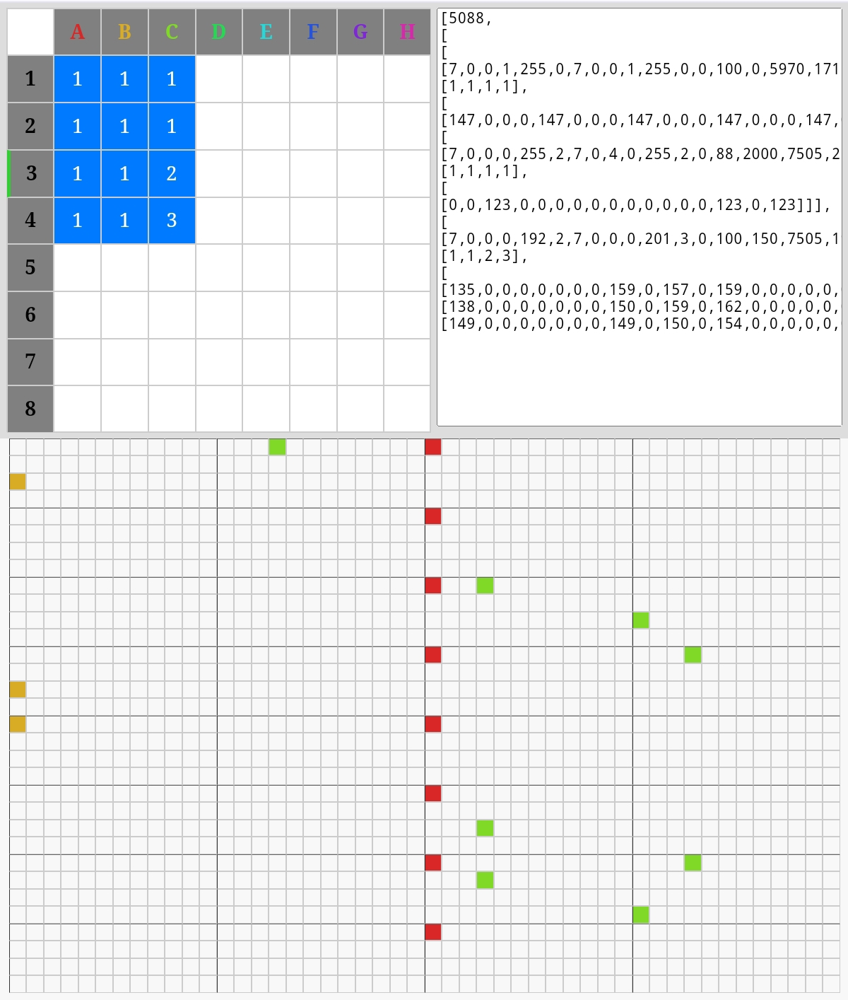

<h1><a href="//bacionejs.github.io/battito/index.html" style="text-decoration: none; color: inherit;">Play</a></h1>

<a href="//bacionejs.github.io/battito/index.html" target="_blank">
    
</a>


Battito is a simple Sonant-based music tracker.

## Purpose
- The trackers I found were either too simple or too complex. This app tries to find a middle ground.

## Guide

- There are eight default instruments, or import from any Sonant-formatted data.
- To enter a note on the piano, first click ONLY one track and ONLY one row in the sequencer and click on the intersecting cell to select a pattern ID. Then you can edit that pattern on the piano. You can reuse a pattern ID.
- The song constantly loops over the selected sequencer rows and columns. To toggle the whole song, click the upper left of the sequencer.
- Supports 9 patterns per track, 8 tracks, and 8 phrases. Each phrase is the length of a pattern, which is 32, so the maximum length of a song is 8 × 32.
- Edit the first value in the textarea to change tempo.
- Pasting into the textarea gives the option to import a whole song or instruments only.
- For an example of music in a game, see [Bike](https://github.com/bacionejs/bike).

## Example Song

You can paste this into the textarea to try a demo song:

```json
[5088,[[[7,0,0,1,255,0,7,0,0,1,255,0,0,100,0,5970,171,2,500,254,1,31,4,21],[1,1,1,1],[[147,0,0,0,147,0,0,0,147,0,0,0,147,0,0,0,147,0,0,0,147,0,0,0,147,0,0,0,147]]],[[7,0,0,0,255,2,7,0,4,0,255,2,0,88,2000,7505,255,2,3144,51,6,60,4,64,0,1,7,179],[1,1,1,1],[[0,0,123,0,0,0,0,0,0,0,0,0,0,0,0,0,0,123,0,123]]],[[7,0,0,0,192,2,7,0,0,0,201,3,0,100,150,7505,191,2,5839,254,6,121,6,147,0,1,6,195],[1,1,2,3],[[135,0,0,0,0,0,0,0,159,0,157,0,159,0,0,0,0,0,0,0,0,0,0,0,147,154,0,159],[138,0,0,0,0,0,0,0,150,0,159,0,162,0,0,0,0,0,0,0,0,0,150,0,162,150,0,159],[149,0,0,0,0,0,0,0,149,0,150,0,154,0,0,0,0,0,0,0,0,0,0,0,147,157,0,159]]]]]
```

## Credits
- Player engine: [pl_synth engine](https://github.com/phoboslab/pl_synth)
- Example song: Simplified version of Beatnic by mBitsnBites
